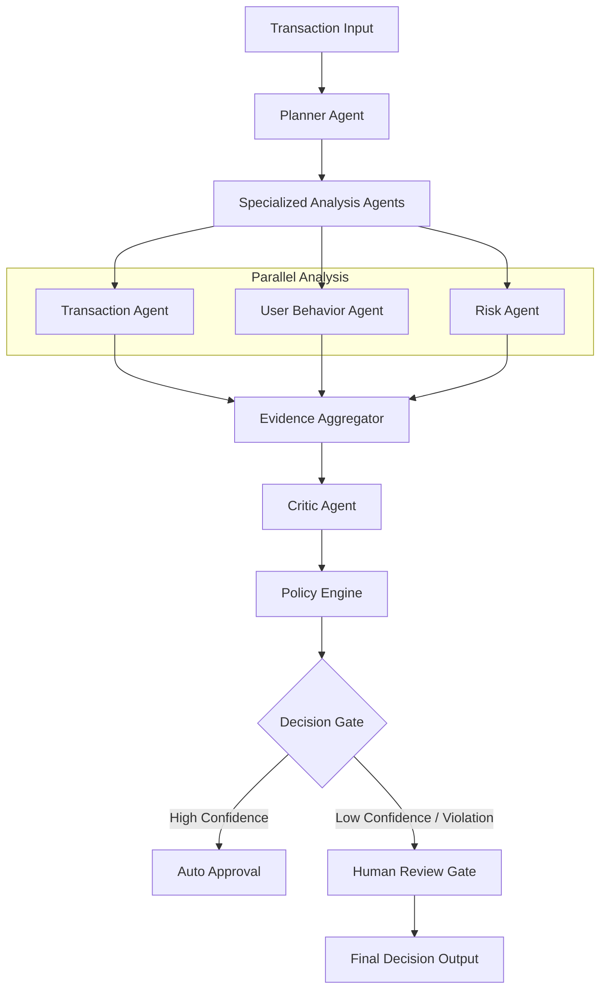

# Xyper-AI: A Governed Agentic AI Framework for Interpretable and Safe Fraud Investigation

🚀 **An AI-Driven Investigation System for Modern Banking Safety**

This repository contains the implementation artifacts, system design, and research materials associated with the paper:

> **A Governed Agentic AI Framework for Interpretable and Safe Fraud Investigation**  
> *Journal: International Journal of Data Science and Analytics (Under Consideration)*

The work presents a **governed agentic AI system** for fraud investigation that prioritizes **interpretability, safety, and human oversight** over black-box automation.

---

## 🧠 Core Philosophy: "Evidence vs. Authority"

Traditional fraud detection systems are often "black boxes" that output binary decisions without reasoning. In banking, this is dangerous due to financial loss, customer dissatisfaction, and regulatory violations. This framework separates evidence generation from decision authority—a native reasoning system designed for safety and interpretability.

Unlike typical ML models, this system does not predict labels. It performs **AI-driven investigations with governance**:

1. **Evidence Agents**: Multiple specialized agents (Transaction, User Behavior, Risk) analyze data in parallel.
2. **The Critic**: A central agent that calibrates confidence, detects conflicts between agents, and validates reasoning logic.
3. **The Policy Engine**: A hard-coded safety layer that enforces regulatory rules (e.g., amount limits, high-risk flags) before any decision is actioned.

---

## 🏗️ System Architecture

The system is composed of multiple specialized agents orchestrated via a governed execution graph:



### Key Components
- **Planner Agent**: Orchestrates the investigation steps based on context and budget.
- **Transaction Agent**: Detects transaction-level anomalies.
- **User Behavior Agent**: Analyzes deviations from historical patterns.
- **Risk Agent**: Evaluates contextual and geographic risk.
- **Critic Agent (Core Innovation)**: Aggregates evidence, performs confidence calibration, and identifies agent disagreements.
- **Prosecutor & Defender**: A multi-agent debate framework where one agent builds a case for fraud and the other for legitimacy, ensuring bias mitigation.
- **Policy Engine**: Enforces strict business constraints and regulatory rules (e.g., no auto-approval for transactions > $500k).
- **Human Review Gate**: Escalates low-confidence or policy-violating cases for human oversight.

---

## 🚦 Decision Governance & Safety

A dedicated governance layer ensures:
- **Bounded Reasoning**: Step limits prevent infinite loops.
- **Budgeting**: Controls external tool/API usage.
- **Confidence Calibration**: Explicit thresholds for automated vs. manual decisions.
- **Policy Compliance**: Hard-coded safety rules that override AI reasoning when necessary.
- **Human-in-the-Loop**: Mandatory escalation for high-stakes or uncertain cases.

This design aligns with principles of **Explainable AI (XAI)** and **responsible AI deployment** in regulated environments.

---

## 📊 Experimental Setup & Evaluation

- **Dataset**: PaySim (synthetic mobile money transaction dataset).
- **Evaluation Strategy**: We prioritize **Decision Safety** and **Escalation Quality** over simple classification accuracy.
  - **Confidence Reliability**: How well the system's "certainty" matches actual risk.
  - **Decision Consistency**: Reproducibility guaranteed via the execution controller.

---

## 🚀 Getting Started

### Prerequisites
- Python 3.9+
- OpenRouter API Key (or OpenAI/Anthropic)
- LangChain & LangGraph

### Installation
```bash
pip install -r requirements.txt
cp .env.example .env  # Add your API keys here
```

### Running Tests
```bash
python run_test.py
```

### Running Evaluation
```bash
python evaluation/evaluation_summary.py
```

---

## 📄 Paper Status & Authors

**Journal: International Journal of Data Science and Analytics (Under Consideration)**
Status: Under editorial processing

### Authors
- **Harsh Satishkumar Patel**  
  MSc Data Science, Dhirubhai Ambani University (DAU), India  
  harshpatel080503@gmail.com

- **Urvi Jitendrabhai Kava**  
  MSc Data Science, Dhirubhai Ambani University (DAU), India  
  urvikawa2004@gmail.com

---

## ⚖️ License & Citation

This project is released under the **MIT License**.

If you find this work useful, please consider citing the paper (once published):
```bibtex
@article{xyper2026agentic,
  title={A Governed Agentic AI Framework for Interpretable and Safe Fraud Investigation},
  author={Patel, Harsh Satishkumar and Kava, Urvi Jitendrabhai},
  journal={SN Computer Science},
  year={2026}
}
```

---
*Built for the next generation of financial safety.*
